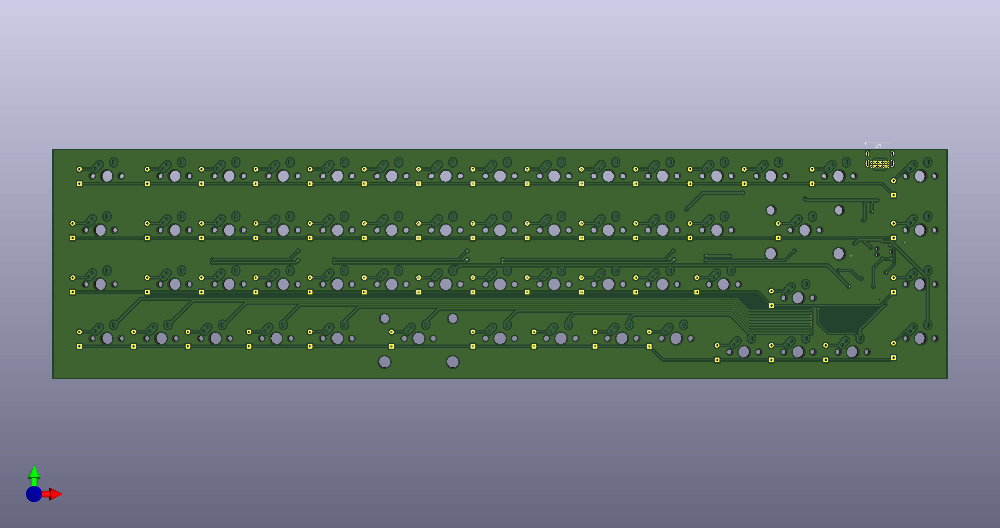
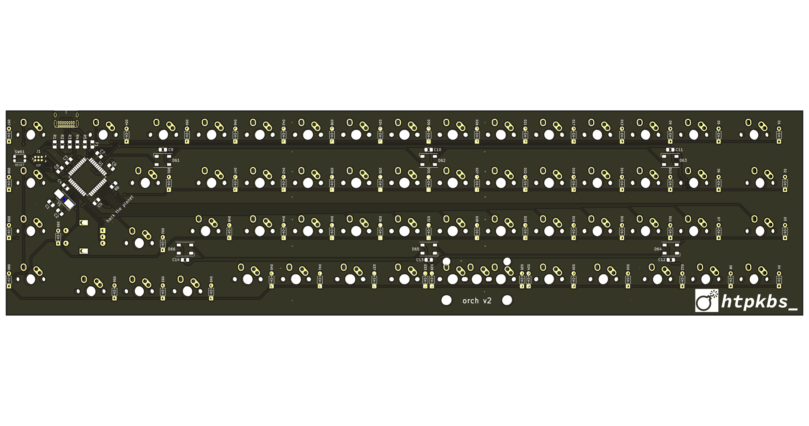
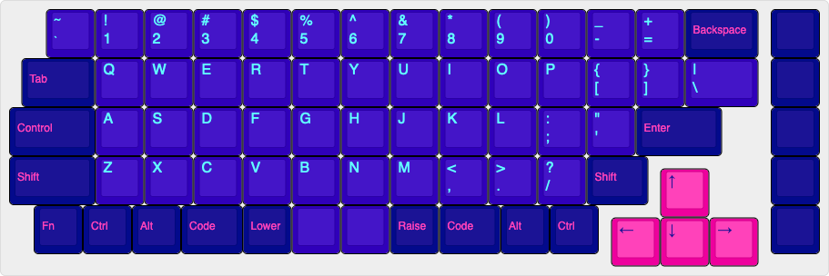

## Overview

The orch is a keyboard PCB.

It has:

* A mostly ortholinear layout
* Key sizes that fit most GMK keycap sets
* 1.25u super/meta/command keys
* 19mm switch spacing
* An arrow key cluster
* A function key column
* USB-C

I know the PCB routing sucks; I was in a rush.

# PCB Renders

# Key Layout

# Sublicenses

* Thank you to [coseyfannitutti](https://github.com/coseyfannitutti) who designed the [Discipline PCB](https://github.com/coseyfannitutti/discipline) for the footprints `D_DO-35_SOD27_P5.08mm_Horizontal.kicad_mod` and `USB_C_GCT_USB4085.kicad_mod`! [The Creative Commons license for these is included here](LICENSE.CFTKB).
* Thanks to [ai03-2725](https://github.com/ai03-2725) for the `MX*` symbols. [The MIT license for these is included here](LICENSE.ai03).
