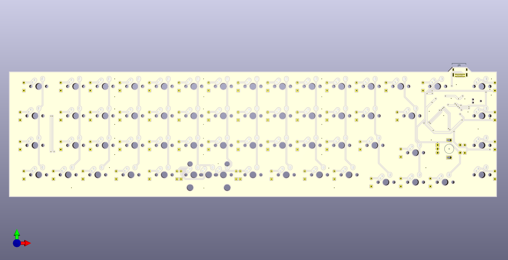
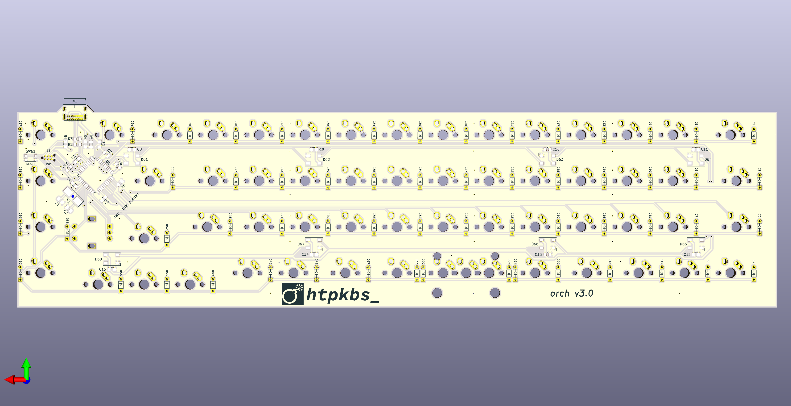

## Overview

The orch is a keyboard PCB. Now on v2!

It has:

* A mostly ortholinear layout
* Key sizes that fit most GMK keycap sets
* 1.25u super/meta/command keys
* 19mm switch spacing
* An arrow key cluster
* A function key column
* USB-C
* A rotary encoder
* No stabilizers unless you want one for a 2U spacebar
* Optional 2U spacebar or 2 1U keys

I know the PCB routing is not great; I was in a rush.

# Key Layout

The key layout looks like this. (Thanks to [Keyboard Layout Editor](http://www.keyboard-layout-editor.com/) for the image.)


This is the corresponding data for pasting into Keyboard Layout Editor:

```
[{x:0.25,c:"#393b3b",t:"#9065c7",a:6,w:1.5},"Tab",{c:"#727474",t:"#c6c9c7",a:4,f:5},"Q","W","E","R","T","Y","U","I","O","P","{\n[","}\n]",{w:1.5},"|\n\\",{c:"#393b3b",x:0.25,t:"#c6c9c7",a:4,f:3},"Page\n\n\n\n\n\nUp"],
[{t:"#689b34",a:6,w:1.75},"Control",{c:"#727474",t:"#c6c9c7",a:4,f:5},"A","S","D","F","G","H","J","K","L",":\n;","\"\n'",{c:"#393b3b",t:"#689b34",a:6,f:3,w:1.75},"Function",{x:1,t:"#c6c9c7",a:4},"Page\n\n\n\n\n\nDown"],
[{t:"#ee6d00",a:6,w:1.75},"Shift",{c:"#727474",t:"#c6c9c7",a:4,f:5},"Z","X","C","V","B","N","M","<\n,",">\n.","?\n/",{c:"#393b3b",t:"#ee6d00",a:6,f:3,w:1.25},"Shift",{x:2.5,t:"#dd1126"},"Code"],
[{y:-0.75,x:13.25,t:"#c6c9c7",a:4,f:5},"&uarr;"],
[{y:-0.25,x:0.5,t:"#ee6d00",a:6,f:3},"Fn",{t:"#0084c2"},"Ctrl","Alt",{t:"#dd1126",w:1.25},"Code",{t:"#0084c2"},"Code",{c:"#727474",t:"#000000",a:7},"","",{c:"#393b3b",t:"#0084c2",a:6},"Code",{t:"#dd1126",w:1.25},"Code",{t:"#0084c2"},"Alt","Ctrl",{x:3.5,t:"#dd1126"},"Code"],
[{y:-0.75,x:12.25,t:"#c6c9c7",a:4,f:5},"&larr;","&darr;","&rarr;"]
```

# PCB Renders





# Case

Case files are in the [case](case) directory. Thanks to the [swillkb Plate & Case Builder](http://builder.swillkb.com/).

# Schematic

[There is a PDF of the schematic here](assets/schematic.pdf).

# AVR Notes

These are just some notes on programming the ATmega32U4. [The datasheet is here](http://ww1.microchip.com/downloads/en/DeviceDoc/Atmel-7766-8-bit-AVR-ATmega16U4-32U4_Datasheet.pdf).

## Programming

ISP headers are included in the "No Legs" Tag-Connect format. You need a Tag-Connect cable and retaining clip board to connect to it. For example, if you have an AVRISP mkII programmer, you need the ["No Legs" cable](https://www.tag-connect.com/product/tc2030-idc-nl) and the [retaining clip board](https://www.tag-connect.com/product/tc2030-retaining-clip-board-3-pack).

## Fuses

Default values are:

```
E:F3, H:99, L:5E
```

### Extended

| Name | Bit | Value | Status | Reason |
| --- | --- | --- | --- | --- |
| - | 7 | 1 | Unprogrammed | Unused |
| - | 6 | 1 | Unprogrammed | Unused |
| - | 5 | 1 | Unprogrammed | Unused |
| - | 4 | 1 | Unprogrammed | Unused |
| HWBE | 3 | 0 | Programmed | Pin used to force bootloader after reset |
| BODLEVEL2 | 2 | 0 | Programmed | 4.3V brown-out reset threshold |
| BODLEVEL1 | 1 | 0 | Programmed | 4.3V brown-out reset threshold |
| BODLEVEL0 | 0 | 0 | Programmed | 4.3V brown-out reset threshold |

Hex value is `F0`.

### High

| Name | Bit | Value | Status | Reason |
| --- | --- | --- | --- | --- |
| OCDEN | 7 | 1 | Unprogrammed | OCD disabled |
| JTAGEN | 6 | 0 | Programmed | JTAG enabled |
| SPIEN | 5 | 0 | Programmed | SPI enabled |
| WDTON | 4 | 1 | Unprogrammed | Watchdog timer in interrupt mode |
| EESAVE | 3 | 1 | Unprogrammed | EEPROM preserved on chip erase |
| BOOTSZ1 | 2 | 0 | Programmed | Default maximum boot size |
| BOOTSZ0 | 1 | 0 | Programmed | Default maximum boot size |
| BOOTRST | 0 | 1 | Unprogrammed | 4.3V brown-out reset threshold |

Hex value is `99`.

### Low

| Name | Bit | Value | Status | Reason |
| --- | --- | --- | --- | --- |
| CKDIV8 | 7 | 1 | Unprogrammed | Don't divide clock by 8 |
| CKOUT | 6 | 1 | Unprogrammed | Don't output clock |
| SUT1 | 5 | 0 | Programmed | Crystal oscillator with BOD enabled |
| SUT0 | 4 | 1 | Unprogrammed | Crystal oscillator with BOD enabled |
| CKSEL3 | 3 | 1 | Unprogrammed | Low power 16MHz crystal oscillator |
| CKSEL2 | 2 | 1 | Unprogrammed | Low power 16MHz crystal oscillator |
| CKSEL1 | 1 | 1 | Unprogrammed | Low power 16MHz crystal oscillator |
| CKSEL0 | 0 | 1 | Unprogrammed | Crystal oscillator with BOD enabled |

Hex value is `DD`.

### Setting Fuse Values

avrdude commands to set the fuse values with an AVRISP mkII programmer:

```
avrdude -p m32u4 -c avrispmkII -U efuse:w:0xF0:m
avrdude -p m32u4 -c avrispmkII -U hfuse:w:0x99:m
avrdude -p m32u4 -c avrispmkII -U lfuse:w:0xDD:m
```

Note that the extended fuse will always show as `C0` with avrdude (despite the datasheet saying that the first four bits are unprogrammed/`1111`).

You may need to erase the chip before you set the fuse values:

```
avrdude -p m32u4 -c avrispmkII -e
```

To-do: mention something about QMK `:production` flag that includes bootloader in resulting `.hex` file. Also confirm the above fuse values...

# Sublicenses

* Thank you to [coseyfannitutti](https://github.com/coseyfannitutti) for the footprints `D_DO-35_SOD27_P5.08mm_Horizontal.kicad_mod` and `USB_C_GCT_USB4085.kicad_mod`. [The Creative Commons license for these is included here](LICENSE.CFTKB).
* Thanks to [ai03-2725](https://github.com/ai03-2725) for the `MX*` symbols. [The MIT license for these is included here](LICENSE.ai03).
